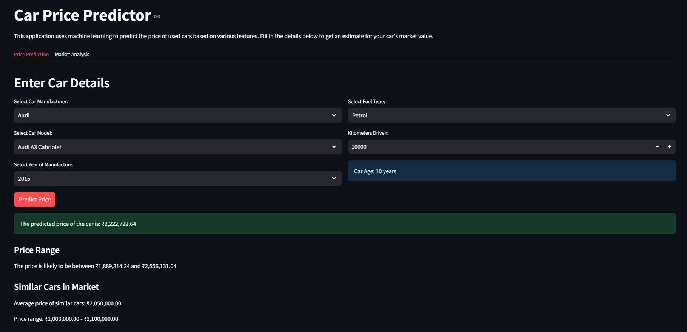

# Car Price Predictor

A machine learning web application that predicts used car prices based on various features such as manufacturer, model, year, kilometers driven, and fuel type. Built with Python, Scikit-learn, and Streamlit.



## 📋 Table of Contents

- [Overview](#overview)
- [Features](#features)
- [File Structure](#file-structure)
- [Installation](#installation)
- [Usage](#usage)
- [Model Development](#model-development)
- [Technologies Used](#technologies-used)
- [Performance](#performance)
- [Future Improvements](#future-improvements)
- [License](#license)

## 🔍 Overview

The Car Price Predictor is a data-driven application that helps users estimate the market value of used cars in India. By inputting details such as the car's manufacturer, model, year of manufacture, kilometers driven, and fuel type, users can get an accurate price prediction along with market analysis insights.

## ✨ Features

- **Car Price Prediction**: Get accurate price estimates for used cars
- **Market Analysis**: View statistics and visualizations of car pricing trends
- **Similar Car Comparison**: Compare predicted prices with similar cars in the database
- **Price Range Estimation**: View confidence intervals for predictions
- **Interactive UI**: User-friendly interface with dropdowns and numerical inputs
- **Data Visualization**: Charts and graphs for market insights

## 📁 File Structure

```
Car-Price-Predictor/
├── app.py                       # Streamlit web application
├── Cleaned_Car_data.csv         # Preprocessed dataset
├── LinearRegressionModel_Final.pkl  # Serialized trained model
├── requirements.txt             # Python dependencies
└── Dockerfile                   # Docker configuration
```

## 🚀 Installation

1. Clone this repository

```bash
git clone https://github.com/yourusername/Car-Price-Predictor.git
cd Car-Price-Predictor
```

2. Install dependencies

```bash
pip install -r requirements.txt
```

3. Run the application

```bash
streamlit run app.py
```

### 🐳 Docker Deployment

You can also run the application using Docker:

```bash
docker build -t car-price-predictor .
docker run -p 8501:8501 car-price-predictor
```

Then access the application at http://localhost:8501

## 💻 Usage

1. Select the car manufacturer from the dropdown menu
2. Choose the specific car model
3. Select the year of manufacture
4. Choose the fuel type
5. Enter the kilometers driven
6. Click "Predict Price" to get the estimated price
7. Explore the Market Analysis tab for additional insights

## 🧠 Model Development

The price prediction model was developed using the following steps:

1. **Data Acquisition**: Used car listing data from Quikr marketplace in India
2. **Data Cleaning**:

   - Removed invalid entries
   - Standardized text fields
   - Converted data types
   - Handled missing values
   - Removed outliers

3. **Feature Engineering**:

   - Created car age feature
   - Standardized car names
   - Encoded categorical variables

4. **Model Training**:

   - Tested multiple regression algorithms
   - Optimized hyperparameters using GridSearchCV
   - Selected best performing model based on R² score

5. **Model Serialization**: Saved the trained model using pickle for deployment

## 🛠️ Technologies Used

- **Python**: Programming language
- **Pandas**: Data manipulation and analysis
- **NumPy**: Numerical computing
- **Scikit-learn**: Machine learning algorithms
- **Matplotlib & Seaborn**: Data visualization
- **Streamlit**: Web application framework
- **Pickle**: Model serialization
- **Docker**: Containerization

## 📊 Performance

The model achieves good accuracy with the following metrics:

- **R² Score**: ~0.85 (may vary based on data splits)
- **Mean Absolute Error**: ~₹50,000
- **Root Mean Squared Error**: ~₹100,000

## 🔮 Future Improvements

- Implement more advanced algorithms like XGBoost
- Add image upload capability for car assessment
- Create a feedback mechanism for continuous model improvement
- Develop a RESTful API for integrations
- Add geolocation-based price adjustments
- Implement user authentication for saved predictions

## 📄 License

This project is licensed under the MIT License - see the LICENSE file for details.

---

Created by [Harry101969] - [harshagrawal2904@gmail.com]
